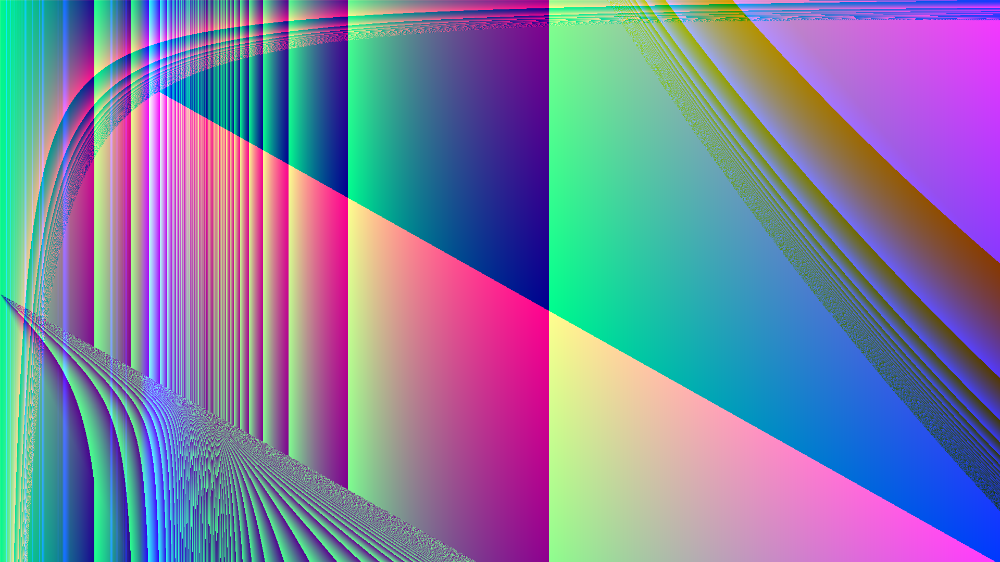

# AutoArt

Art generated using random functions.



[A (slower) web version of AutoArt can be found here](https://pommicket.com/pommicket)

To run AutoArt, just download one of the [releases](https://github.com/pommicket/autoart/releases). Note that on Windows, when the images/videos/audios are done generating, the command prompt window will just close. Your images/videos/audios will be in whatever directory the executable was in (unless you haven't installed ffmpeg).

**You will need [ffmpeg](http://ffmpeg.org/) for AutoVideos**, but not for AutoImages/Audio.  

On Windows, you can install ffmpeg by [downloading a build](https://ffmpeg.zeranoe.com/builds/). Just extract the zip, and copy the file `ffmpeg.exe` in the `bin` directory to the directory where `autoart.exe` is located.

You can install ffmpeg on OS X via [homebrew](https://brew.sh) with
```bash
brew install ffmpeg
```

And you can install it on Debian/Ubuntu with:
```bash
sudo apt install ffmpeg
```

## How it works

To make an image, AutoImages starts by generating three random functions: `r(x, y)`, `g(x, y)`, and `b(x, y)`. These functions take in the x and y coordinates of a pixel (divided by the width and height respectively of the image), and return a number from 0-1 (they can actually return any number, but the result is taken modulo 1). This number refers to the red, green, or blue value of the pixel. So, if the three functions were
```
r(x, y) = x + y
g(x, y) = x * y
b(x, y) = 2 * x
```
and you generated a 100x100 image, the pixel at (20, 40) would have these color values:
```
r(0.2, 0.4) = 0.2 + 0.4 = 0.6
g(0.2, 0.4) = 0.2 * 0.4 = 0.08
b(0.2, 0.4) = 2 * 0.2 = 0.4
```
which corresponds to a dark magenta.

AutoVideos adds a third parameter to each of these functions, `t`, which is the time in seconds.

## Options

Here is a description of some of the options you can set in AutoArt. If you don't understand or don't care about an option, you can just leave it blank and the default will be used.

### AutoImages

Width - the width of the image in pixels   
Height - the height of the image in pixels   
How many - how many images you want to generate  
Should a palette be used? - if a palette is used, images will have a fixed number of colors. The color at a pixel is determined by one function per color, where the first function which returns a negative value's color is assigned to a pixel.  
Function length - the length of the functions used to generate the images.  
Should an alpha channel be included? - determines whether or not an alpha (transparency) channel will be included in the image.  
Which coordinate system should be used? - Should the functions be based on x and y (cartesian) coordinates, or r and theta (polar) coordinates?  
Random seed - Seed for the random number generator.  If you run AutoArt twice with the same settings and same seed, **as long as you only create 1 image/video/audio**, you will get the same thing. (Because when you create multiple images they are created in parallel, it won't necessarily be the same each time with the same seed).

#### Not paletted
Color space - Which color space should be used - more info [here](https://en.wikipedia.org/wiki/Color_space)  
How should out of range values be dealt with? - What to do when `r/g/b(x, y)` returns a value less than 0 or greater than 1. Modulo will use the [modulo](https://en.wikipedia.org/wiki/Modulo_operation) function, clamp will just keep it at 0 if it's negative, and keep it at 1 if it's >1, and sigmoid will use the [sigmoid](https://en.wikipedia.org/wiki/Sigmoid_function) function.

#### Paletted
How many colors do you want? - The number of colors to use.

### AutoVideos
Most of the options are the same as AutoImages, with the following exceptions:

Length in seconds - The length of the video in seconds  
Frame rate - The number of frames per second in the video. Videos with lower frame rates will be generated faster, but will not be as smooth.

### AutoAudio
Some of the settings are the same as AutoImages/AutoVideos. The following settings are not:

Sample rate - The number of audio samples per second. Audio with a lower sample rate will  be generated faster, but won't sound as good.


## Building AutoArt
If you want to build AutoArt yourself, you'll need to install [Go](https://golang.org). Then, you can do:
```bash
go get https://github.com/pommicket/autoart
cd $GOPATH/src/github.com/pommicket/autoart
mkdir -p bin
go build -o bin/autoart
```

### License
AutoArt is licensed under the GNU General Public License, version 3. A copy of the license is in the file named `LICENSE`.
